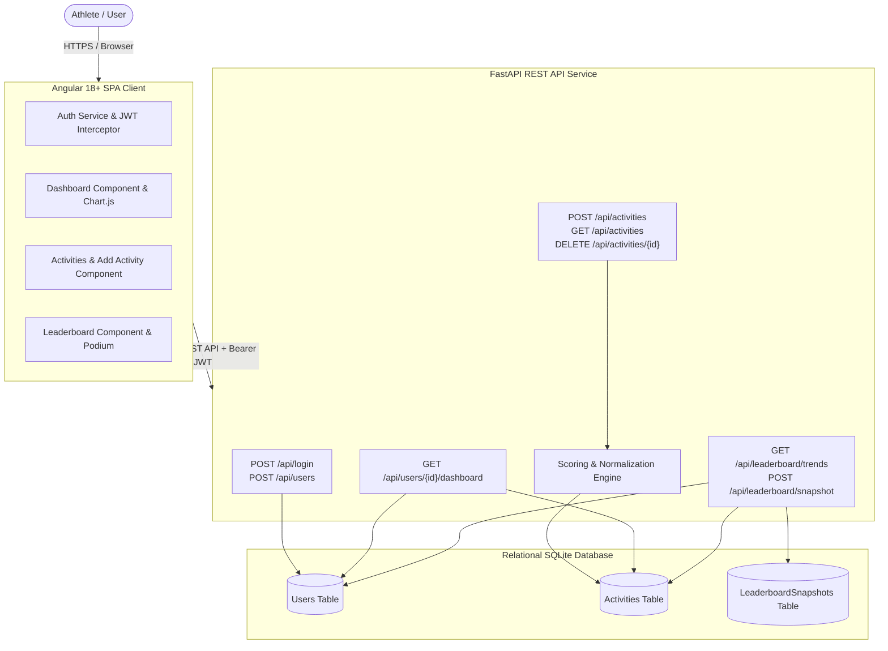
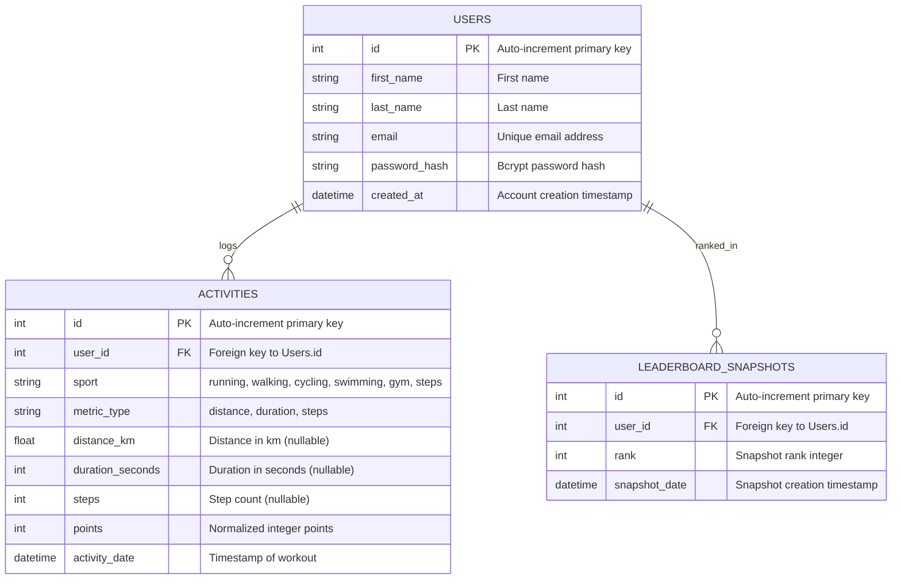

# Fitness Challenge Application — Software Design Document

## Executive Summary
The **Fitness Challenge Application** is a full-stack gamified fitness platform designed to track diverse physical activities across different sports—**Running, Walking, Cycling, Gym, Swimming, and Daily Steps**—and normalize their metrics into a unified scoring system. This allows athletes with different fitness disciplines to compete equitably on a global real-time leaderboard while tracking their individual progression via an interactive personal dashboard.

---

## a. System Architecture & Data Flow

### 1. High-Level Architecture Overview
The system follows a modern decoupled client-server architecture:
- **Frontend Client**: Single Page Application (SPA) built with **Angular 18+** (Standalone Components, Signals, Reactive Forms, Chart.js).
- **Backend API Server**: High-performance RESTful API service built with **Python & FastAPI** (Pydantic validation, bcrypt password hashing, JWT authentication).
- **Database Layer**: Relational Database (**SQLite**) managed via **SQLAlchemy ORM**.



### 2. Request / Response Data Flow

#### A. User Registration Flow
1. Client sends `POST /api/users` with `{ first_name, last_name, email, password }`.
2. Backend validates schema using Pydantic `UserCreate`.
3. Backend performs a **case-insensitive duplicate check** on `(lower(first_name), lower(last_name))` and `email`. If duplicate, responds with `HTTP 400 Bad Request`.
4. Password is securely hashed using `bcrypt.hashpw` with salt.
5. User entity is saved to SQLite, returning `HTTP 200` with unique `userId`.

#### B. Activity Data Ingestion Flow
1. Authenticated user sends `POST /api/activities` with `{ sport, metric_type, distance_km, duration_seconds, steps }`.
2. Backend verifies bearer JWT token and extracts authenticated `user_id`.
3. Ingestion validation verifies:
   - `sport` belongs to supported set `[running, walking, cycling, swimming, gym, steps]`.
   - `metric_type` strictly matches the sport category (`distance`, `duration`, or `steps`). If mismatched, returns `HTTP 400 Bad Request`.
   - Metric value is greater than 0 (`gt=0`).
4. **Scoring Normalization Engine** computes exact floored integer points.
5. Record is persisted with timestamp, points, and metric attributes.

---

## b. Database Schema & Data Model

### Entity-Relationship Diagram (ERD)


### Duplicate User Detection Enforcement
- **Database Level**: Unique constraint index on `User.email`.
- **Application Level**: Case-insensitive query using `func.lower(User.first_name) == func.lower(request.first_name)` AND `func.lower(User.last_name) == func.lower(request.last_name)` to prevent duplicate registrations like `"John Doe"` and `"john doe"`.

---

## c. API Specifications

### 1. User Registration API
- **Route**: `POST /api/users`
- **Request Body**:
  ```json
  {
    "first_name": "Alice",
    "last_name": "Walker",
    "email": "alice@example.com",
    "password": "SecurePassword123!"
  }
  ```
- **Validation**:
  - `first_name`, `last_name`, `email`, `password` required strings.
  - Case-insensitive name uniqueness check.
- **Success Response (`HTTP 200 OK`)**:
  ```json
  {
    "userId": 1,
    "message": "User created",
    "first_name": "Alice",
    "last_name": "Walker",
    "email": "alice@example.com"
  }
  ```
- **Error Response (`HTTP 400 Bad Request`)**:
  ```json
  {
    "detail": "A user with this name already exists"
  }
  ```

### 2. Activity Ingestion API
- **Route**: `POST /api/activities`
- **Headers**: `Authorization: Bearer <jwt_token>`
- **Request Body (Distance Sport)**:
  ```json
  {
    "sport": "running",
    "metric_type": "distance",
    "distance_km": 5.0
  }
  ```
- **Request Body (Duration Sport)**:
  ```json
  {
    "sport": "swimming",
    "metric_type": "duration",
    "duration_seconds": 1800
  }
  ```
- **Request Body (Count Sport)**:
  ```json
  {
    "sport": "steps",
    "metric_type": "steps",
    "steps": 10000
  }
  ```
- **Validation Rules**:
  - `sport` must be one of `['running', 'walking', 'cycling', 'swimming', 'gym', 'steps']`.
  - `metric_type` must match sport mapping. Mismatches return `HTTP 400 Bad Request`.
  - Values must be strictly greater than 0 (`> 0`). Non-positive values return `HTTP 400 Bad Request`.
- **Success Response (`HTTP 200 OK`)**:
  ```json
  {
    "activityId": 42,
    "userId": 1,
    "message": "Activity Recorded",
    "sport": "running",
    "metric_type": "distance",
    "points": 500,
    "distance_km": 5.0,
    "duration_seconds": null,
    "steps": null
  }
  ```

### 3. Global Leaderboard & Trends API
- **Route**: `GET /api/leaderboard/trends`
- **Success Response (`HTTP 200 OK`)**:
  ```json
  [
    {
      "user_id": 2,
      "rank": 1,
      "name": "Jane Doe",
      "total_points": 1250,
      "previous_rank": 2,
      "trend": "up"
    },
    {
      "user_id": 1,
      "rank": 2,
      "name": "Alice Walker",
      "total_points": 950,
      "previous_rank": 1,
      "trend": "down"
    }
  ]
  ```

### 4. Personal Dashboard API
- **Route**: `GET /api/users/{user_id}/dashboard`
- **Success Response (`HTTP 200 OK`)**:
  - Aggregates `total_points`, `global_rank`, `streak_days`, `athlete_tier`, `weekly_stats`, `recent_activities`, `volume_over_time`, and `sport_breakdown`.

---

## d. Scoring & Normalization Logic

All activities are normalized into a unified integer **Points** metric:

| Activity | Metric | Conversion Rate | Mathematical Implementation | Example |
| :--- | :--- | :--- | :--- | :--- |
| **Running** | Distance (km) | **100 Points / km** | `math.floor(distance_km * 100)` | 5.0 km = 500 pts |
| **Walking** | Distance (km) | **50 Points / km** | `math.floor(distance_km * 50)` | 1.55 km = 77 pts (`floor(77.5)`) |
| **Cycling** | Distance (km) | **25 Points / km** | `math.floor(distance_km * 25)` | 15.0 km = 375 pts |
| **Swimming** | Duration (min:sec) | **15 Points / min** | `(duration_seconds // 60) * 15` | 1m 55s (115s) = 15 pts |
| **Gym** | Duration (min:sec) | **5 Points / min** | `(duration_seconds // 60) * 5` | 45 min (2700s) = 225 pts |
| **Daily Steps** | Count (integer) | **1 Point / 100 steps** | `(steps // 100) * 1` | 399 steps = 3 pts; 10,000 = 100 pts |

### Flooring & Precision Rules
1. **Distance**: Points scale linearly based on distance, but fractional points are floored to the nearest integer using `math.floor()`.
2. **Duration**: Only fully completed minutes count. Time is floored to whole minutes via integer floor division `// 60`. Uncompleted seconds (e.g. 59s) yield 0 points.
3. **Steps**: Points are awarded strictly for completed blocks of 100 steps using integer floor division `// 100`.

---

## e. Frontend Architecture & Visualizations

The frontend is architected with modern Angular components:
- **`App` (Shell Layout)**: Adaptive desktop sidebar and collapsible off-canvas mobile drawer with smooth blur backdrop.
- **`Dashboard`**:
  - **Gamification Hero**: Real-time rank, streak counter, athlete tier badge (*Bronze*, *Silver*, *Gold*, *Platinum*, *Diamond Elite*), and level progression bar.
  - **1-Click Fast Workouts**: Instant presets for fast workout logging.
  - **Interactive Chart.js Visualizations**: Volume line chart with 7D/30D/All-Time filters and Doughnut chart for sport distribution.
  - **Weekly Goals & Consistency Tracker**: 7-day visual workout dot checklist.
- **`AddActivity`**:
  - 3x2 Visual Sport Selector card grid.
  - Dynamic input switching with 1-click stepper chips (`+1km`, `15min`, `5000 steps`).
  - Real-time Live Points Preview calculator.
- **`Activities` (History Log)**:
  - 4 summary metrics cards, interactive sport filter pills, search & sort toolbar, 1-click delete with toast feedback.
- **`Leaderboard`**:
  - 3-Pillar Winners Podium Showcase (Gold #1 with crown animation, Silver #2, Bronze #3).
  - Current logged-in athlete highlight banner with overtake point distance calculator.
  - Trend badges (`↑`, `↓`, `—`, `★ New`).

---

## f. Trade-offs & Edge Cases

| Edge Case / Scenario | Challenge | Solution & Mitigation |
| :--- | :--- | :--- |
| **Duplicate User Names** | Users registering with varying letter casing (e.g. `"John Doe"` vs `"john doe"`). | Normalized name comparison using `func.lower()` at DB query layer to guarantee case-insensitive uniqueness. |
| **Floating-Point Imprecision** | IEEE-754 decimal artifacts (e.g., `1.55 * 50 = 77.50000000000001`). | Explicit `math.floor(float(val) * rate)` conversion ensuring exact integer points. |
| **Partial Units Ingestion** | Sub-minute durations (e.g. 45s) or sub-hundred steps (e.g. 99 steps). | Integer floor division `//` ensures strictly completed blocks receive points; partial remainders floor to 0. |
| **Schema Mismatches** | Ingesting duration with running or distance with gym. | Strict dictionary mapping validation returning `HTTP 400 Bad Request` with descriptive error messages. |
| **Unauthenticated Ingestion** | Direct API callers omitting JWT token. | Fallback check for `activity.user_id` with existence verification, otherwise returning `HTTP 401 Unauthorized`. |
| **Zero / Negative Metric Ingestion** | Submitting negative distance or 0 duration. | Pydantic `gt=0` constraints and manual verification returning `HTTP 400 Bad Request`. |
| **Responsive Screen Sizes** | Variable viewport dimensions from 320px mobile to 4K displays. | Fluid CSS Grid / Flexbox layouts, off-canvas sliding navigation, and responsive chart resizing. |

---

## Verification & Test Results
- **Automated Backend Test Suite**: `pytest test_fitness_challenge.py` — **18/18 tests passed (100%)** with 0 warnings.
- **Frontend Unit Test Suite**: `ng test --watch=false` — **11/11 test suites passed (100%)**.
- **Frontend Production Build**: `ng build` — **Compiled cleanly with 0 errors**.

